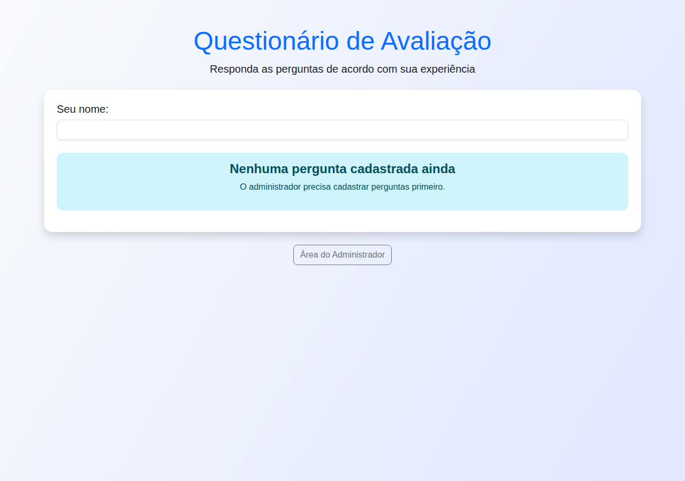

# Questionnaire Manager

Aplicação web em **Flask** para criar e gerenciar questionários — com autenticação, painel admin, importação em lote, exportação CSV/Excel, API REST, compartilhamento por link e webhooks.

## Badges


-B7178C?style=flat)


## Problema → Solução

**Problema:** gerenciar questionários com perguntas ponderadas (pesos) e respostas pontuáveis de forma manual (planilhas, papel), sem histórico, sem relatórios e sem integração.

**Solução:** aplicação web completa que centraliza a criação de questionários, coleta respostas com pontuação automática e expõe resultados em painel admin — com **exportação CSV/Excel**, **API REST**, **webhooks** para notificação, **importação em lote** e **links compartilháveis** com expiração.

## Arquitetura

```
Navegador ──► Flask App (templates Jinja2 + admin.js + style.css)
                  │
                  ├── auth/     → /auth/register, /auth/login, /auth/logout (Flask-Login + Bcrypt)
                  ├── main/     → questionário público, admin, export, webhooks, share
                  ├── API       → flask-restx em /api/docs (requer login)
                  │
                  ├── SQLAlchemy (SQLite) → User, Questionnaire, Question,
                  │                        Option, Resultado, ShareLink,
                  │                        Webhook, QuestionTemplate
                  └── Extras: CSRF, rate limit (Flask-Limiter), Marshmallow,
                              pystray (bandeja de sistema), PyInstaller
```

Principais fluxos:

```
Usuário responde → POST /submit_questionario → pontuação calculada → Resultado salvo
                   + dispara webhooks ativos (POST na URL configurada)
Admin → painel /admin → CRUD de perguntas/opções, importação em lote,
        exportação CSV/Excel, templates, share links, gráficos (Chart.js)
```

## Stack

| Camada         | Tecnologia                                        |
|----------------|---------------------------------------------------|
| Linguagem      | Python 3.11                                       |
| Framework      | Flask 2.3 + Jinja2                                |
| Autenticação   | Flask-Login + Flask-Bcrypt + CSRF                 |
| Banco de dados | SQLAlchemy (SQLite por padrão)                    |
| API            | flask-restx (docs em `/api/docs`)                 |
| Validação      | Marshmallow + Flask-WTF                           |
| Extras         | Flask-Limiter, openpyxl (Excel), Chart.js, SortableJS |
| Empacotamento  | Docker / PyInstaller + pystray (bandeja)          |
| Testes         | pytest + pytest-cov, ruff, black                  |

## Quickstart

### Local

```bash
python -m venv venv
source venv/bin/activate          # Windows: venv\Scripts\activate
pip install -r requirements.txt
python run.py                     # abre http://127.0.0.1:5000
```

No primeiro acesso, cadastre o usuário administrador (o cadastro é liberado apenas para o primeiro usuário). Os dados ficam em `~/Documents/questionnaire-manager/`.

### Docker

```bash
docker compose up --build
```

A aplicação sobe em `http://localhost:5000`.

> **Atenção:** o `run.py` inicializa a bandeja de sistema (**pystray**), que exige um display gráfico. Em ambientes headless (CI, servidores sem X) o container não sobe — é necessário um display (ex.: `xvfb`) ou substituir o entrypoint por um servidor WSGI sem a bandeja.

### App desktop (PyInstaller)

```bash
python build_exe.py               # gera executável com bandeja de sistema
```

## Screenshot



## Testes

```bash
pytest --cov=app    # 23 testes (auth, perguntas, submissão, API, segurança)
ruff check .
black --check .
```

## Roadmap / Status

**Status:** funcional. **Roadmap:**

- [ ] Roles/permissões entre múltiplos usuários (hoje é single-admin)
- [ ] Respostas por questionário individual (vincular `questionnaire_id` às perguntas)
- [ ] Retry e fila de entregas de webhooks
- [ ] Migração de banco para PostgreSQL

## Licença

[MIT](LICENSE)